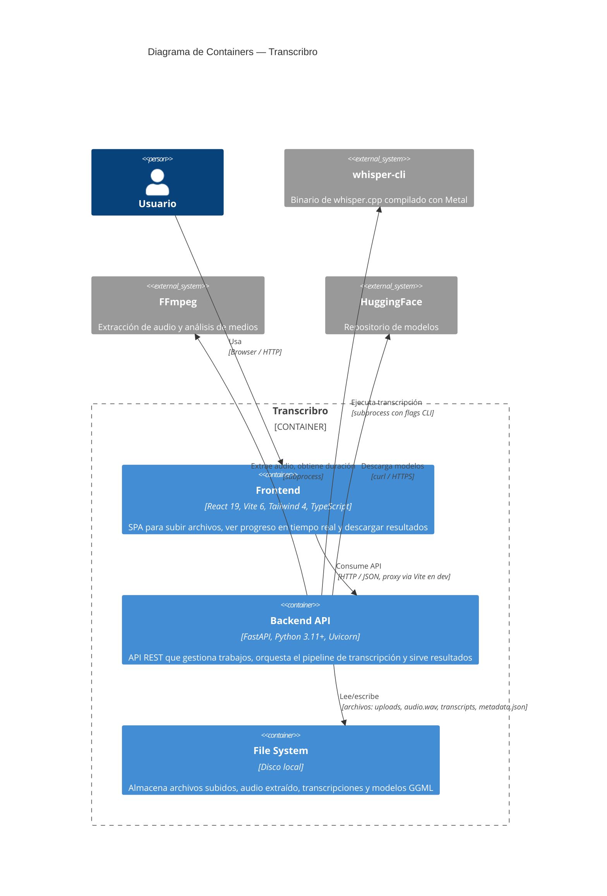

# C4 Nivel 2 — Diagrama de Containers

Muestra los bloques técnicos que componen Transcribro y cómo se comunican entre sí.

## Containers

### Frontend

| Aspecto | Detalle |
|---------|---------|
| **Tech stack** | React 19 + Vite 6 + Tailwind CSS 4 + TypeScript |
| **Puerto** | `localhost:5173` (dev) |
| **Comunicación** | HTTP polling cada 2-3s al backend |
| **Responsabilidades** | Upload con drag & drop, configuración de transcripción, progreso en tiempo real, visor de transcripciones, gestión de modelos |

### Backend API

| Aspecto | Detalle |
|---------|---------|
| **Tech stack** | FastAPI + Uvicorn + Pydantic |
| **Puerto** | `localhost:8000` |
| **Endpoints** | `/api/transcribe`, `/api/jobs`, `/api/models`, `/api/health` |
| **Arquitectura** | Clean Architecture: `domain/` → `application/` → `infrastructure/` |
| **Responsabilidades** | Validación de archivos, cola de trabajos (asyncio.Queue), orquestación del pipeline de 3 etapas, gestión de modelos |

### File System

| Directorio | Contenido |
|------------|-----------|
| `data/jobs/{job_id}/` | `metadata.json`, `input.*`, `audio.wav`, `transcript.{json,txt,srt,vtt}`, `partial_segments.json` |
| `data/models/` | Archivos `ggml-{model}.bin` (77 MB — 3 GB) |

## Decisiones de diseño relevantes

- El frontend se comunica con el backend **solo via HTTP polling** (no WebSockets) — ver [ADR-002](../decisions/002-polling-over-websockets.md)
- Los trabajos se procesan de forma **secuencial** en una cola FIFO — ver [ADR-003](../decisions/003-sequential-job-queue.md)
- No hay base de datos; la persistencia es el **file system** con `metadata.json` por trabajo
