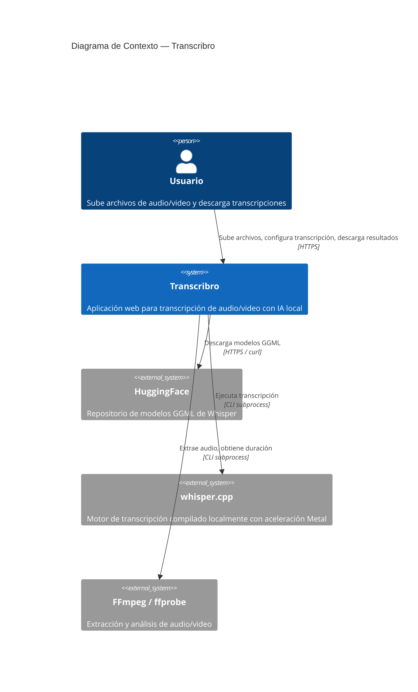

# C4 Nivel 1 — Diagrama de Contexto

Muestra Transcribro como un sistema completo, sus usuarios y los sistemas externos con los que interactúa.

## Descripción

| Elemento | Descripción |
|----------|-------------|
| **Usuario** | Persona que necesita transcribir archivos multimedia a texto |
| **Transcribro** | Aplicación web que orquesta el proceso de transcripción |
| **whisper.cpp** | Binario compilado desde source, ejecuta la inferencia del modelo Whisper en GPU (Metal) o CPU |
| **FFmpeg** | Herramienta del sistema para extraer audio (WAV 16kHz mono) y obtener metadatos del archivo |
| **HuggingFace** | Fuente externa para descargar modelos (tiny a large-v3, de 77 MB a 3 GB) |

## Notas

- Todo el procesamiento es **local** — no se envían datos a servicios externos
- La única comunicación externa es la descarga de modelos desde HuggingFace
- whisper.cpp y FFmpeg son dependencias del sistema, no servicios remotos
