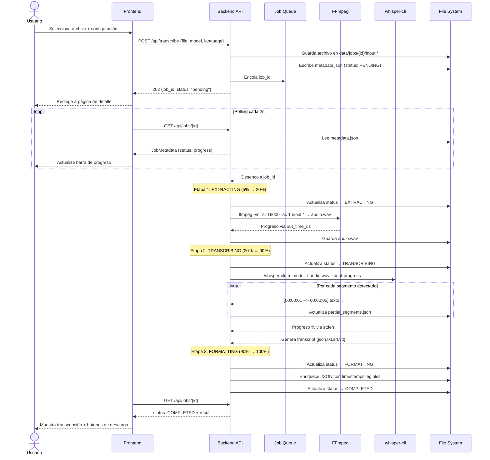
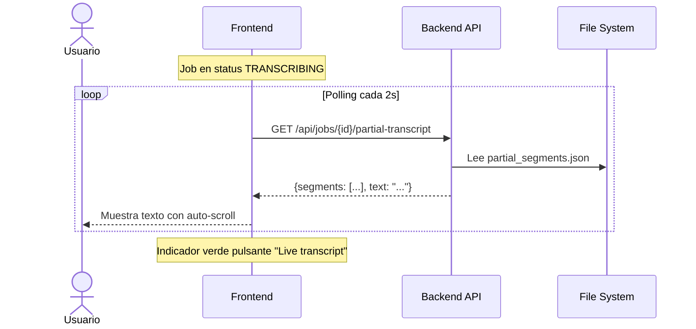
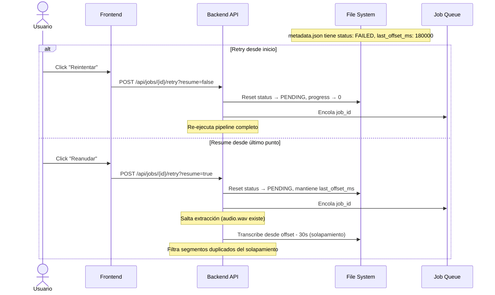
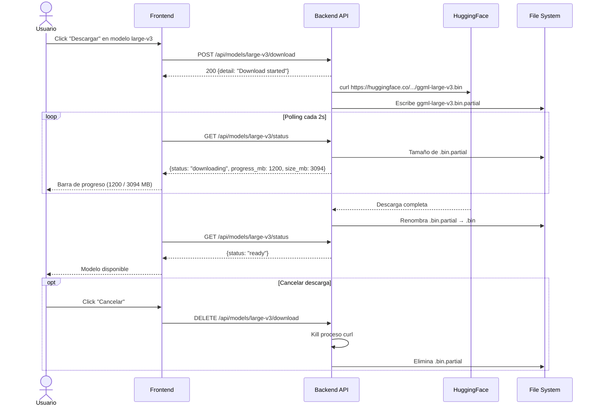
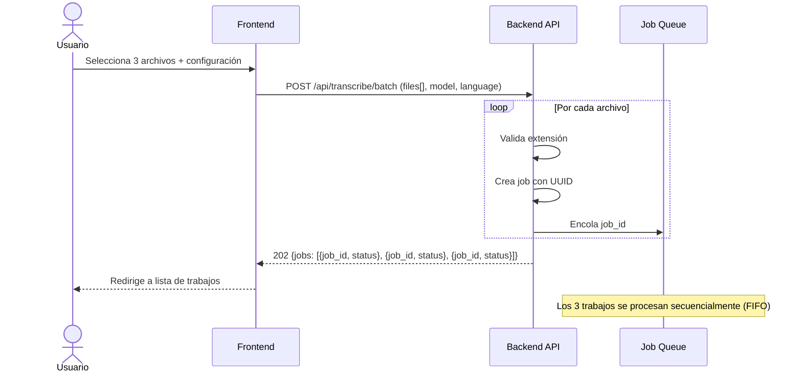

# Diagramas de Secuencia

## 1. Flujo principal: subir y transcribir un archivo

## 2. Transcripción en vivo (partial segments)

## 3. Reintentar / reanudar un trabajo fallido

## 4. Descarga de modelos

## 5. Subida en lote (batch)

